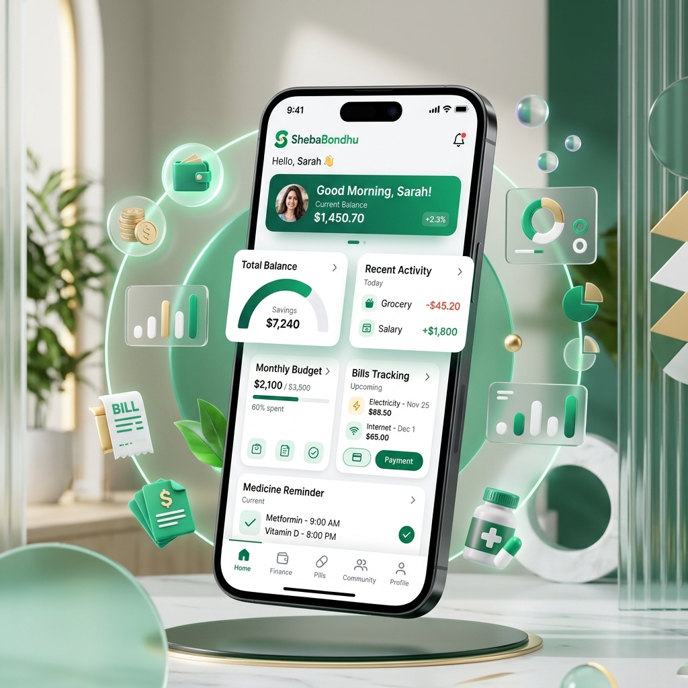
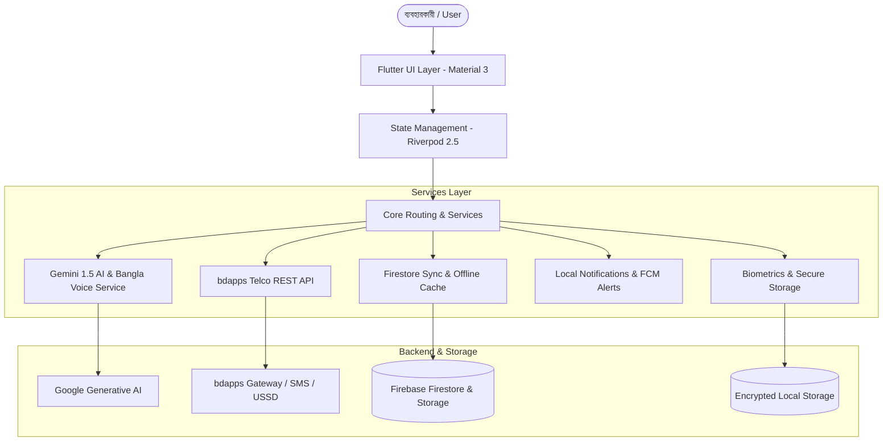

<div align="center">

  

  

  # 📱 সেবা বন্ধু (Sheba Bondhu)
  ### *আপনার বিশ্বস্ত AI ব্যক্তিগত স্মৃতি সহকারী*
  **AI-Powered Everyday Life & Smart Memory Assistant for Bangladesh**

  [](https://flutter.dev)
  [](https://dart.dev)
  [](https://firebase.google.com)
  [](https://ai.google.dev)
  [](https://bdapps.com)
  [](LICENSE)

  <br/>

  [**🌐 লাইভ ল্যান্ডিং পেজ**](https://www.bdappsdigitalapps.com/NADB26105_FinalProject/sheba_bondhu) • [**📥 সরাসরি APK ডাউনলোড**](https://www.bdappsdigitalapps.com/NADB26105_FinalProject/sheba_bondhu/ShebaBondhu.apk) • [**✨ মূল ফিচারসমূহ**](#-মূল-ফিচারসমূহ-key-features) • [**🛠️ ইনস্টলেশন**](#-ইনস্টলেশন-ও-রান-করার-পদ্ধতি)

</div>

---

## 📖 পরিচিতি (Overview)

**সেবা বন্ধু (Sheba Bondhu)** হলো বাংলাদেশের সাধারণ মানুষের দৈনন্দিন জীবনের জটিল হিসাব-নিকাশ, ইউটিলিটি বিল, ওষুধের সময়সূচী, জরুরি কাগজপত্র এবং ওয়ারেন্টি ব্যবস্থাপনাকে এক ছাতার নিচে নিয়ে আসার একটি অত্যাধুনিক **AI-চালিত ব্যক্তিগত স্মৃতি সহকারী (Smart Personal Assistant App)**।

বাংলা ভাষাভাষী কোটি মানুষের কথা বিবেচনা করে এতে যুক্ত করা হয়েছে **Google Gemini AI** এবং **বাংলা ভয়েস কমান্ড সিস্টেম (Voice STT/TTS)**। ব্যবহারকারী মুখে বাংলায় সাধারণ বাক্য বললেই অ্যাপটি নিজে বুঝে স্বয়ংক্রিয়ভাবে রিমাইন্ডার ও ডেটা এন্ট্রি তৈরি করে নেয়। এছাড়াও এটি **bdapps (Robi/Airtel)** ইকোসিস্টেমের সাথে সরাসরি ইন্টিগ্রেটেড, যার ফলে ইন্টারনেট সংযোগ ছাড়াও মোবাইল এসএমএস ও ইউএসএসডি কোডের মাধ্যমে গুরুত্বপূর্ণ সব অ্যালার্ট পাওয়া সম্ভব।

> *"সমস্যা বলুন, করণীয় জানুন — সেবা বন্ধু সবসময় আপনার সাথে।"*

---

## ✨ মূল ফিচারসমূহ (Key Features)

### 🎙️ ১. বাংলা AI ভয়েস ও কুইক-অ্যাড (Bangla AI Quick-Add)
* **Google Gemini AI 1.5 ইঞ্জিন:** যেকোনো প্রাকৃতিক বাংলা বা ইংলিশ বাক্য লিখে বা ভয়েসে বললে সিস্টেম ইন্টেন্ট শনাক্ত করে।
* **বাংলা স্পিচ-টু-টেক্সট (STT) ও টেক্সট-টু-স্পিচ (TTS):** মুখে বলুন *"কাল সকাল ১০টায় ডেসকো বিদ্যুৎ বিল ৫০০ টাকা জমা দিতে হবে"* — অ্যাপ স্বয়ংক্রিয়ভাবে ক্যাটাগরি, তারিখ ও টাকার পরিমাণ ফিল্টার করে রিমাইন্ডার সেট করে দেবে।
* **স্মার্ট প্রিভিউ শিট:** এন্ট্রি সংরক্ষণ করার আগে সুন্দর প্রিভিউ কার্ড এবং একক ক্লিকে সংশোধন করার সুবিধা।

### 💰 ২. হিসাব-কিতাব ও দেনা-পাওনা ট্র্যাকার (Smart Money Manager)
* **আয়, ব্যয় ও ক্যাশ ফ্লো:** দৈনন্দিন আয় ও ব্যয়ের নিখুঁত ডিজিটাল ডায়রি।
* **দেনা ও পাওনা খতিয়ান:** কার কাছ থেকে টাকা পাবেন এবং কাকে কত পরিশোধ করতে হবে তা নাম, তারিখ ও নোটসহ ট্র্যাকিং।
* **আর্থিক রিপোর্ট ও বিশ্লেষণ (Financial Statements):** ক্যাটাগরিভিত্তিক পাই-চার্ট, মাসিক সামারি এবং এক্সপোর্টযোগ্য স্টেটমেন্ট।

### ⚡ ৩. ইউটিলিটি বিল অ্যালার্ট ও হিস্ট্রি (Smart Bill Reminder)
* **সকল বাংলাদেশি ইউটিলিটি সাপোর্ট:** বিদ্যুৎ (DESCO, DPDC, NESCO, REB), পানি (WASA), গ্যাস (Titas, Bakhrabad), ইন্টারনেট/ওয়াইফাই, বাড়ি ভাড়া ও ক্যাবল বিল।
* **কাউন্টডাউন ও পেনাল্টি সতর্কবার্তা:** বিলের শেষ তারিখের পূর্বে পুশ নোটিফিকেশন এবং মেয়াদোত্তীর্ণের রেড অ্যালার্ট।
* **বিল পরিশোধ রশিদ:** পেইড রশিদের ছবি তুলে সুরক্ষিতভাবে ক্লাউডে আপলোড করে রাখার সুবিধা।

### 💊 ৪. ওষুধ ও স্বাস্থ্য রিমাইন্ডার (Medicine & Dosage Scheduler)
* **দুটো ও তিনটি ডোজ শিডিউলিং:** সকাল, দুপুর, রাত — খাওয়ার আগে না পরে তা সহ ওষুধের সঠিক ডোজ নির্ধারণ।
* **স্টক ট্র্যাকার ও রিফিল অ্যালার্ট:** পাতা বা বোতলে আর কয়টি ওষুধ বাকি আছে তা গুনে শেষ হওয়ার পূর্বেই অ্যালার্ট দেওয়া।
* **প্রেসক্রিপশন আর্কাইভ:** ডাক্তার ও প্রেসক্রিপশনের ছবি সেভ করে রাখা।

### 🛡️ ৫. জরুরি ডিজিটাল দলিল ও আইডি ভল্ট (Secure Document Vault)
* **জাতীয় পরিচয়পত্র ও লাইসেন্স ভল্ট:** এনআইডি (NID), পাসপোর্ট, ড্রাইভিং লাইসেন্স, জন্ম নিবন্ধন, শিক্ষাগত সনদপত্র।
* **মেয়াদোত্তীর্ণের পূর্বাভাস (Expiry Alerts):** পাসপোর্ট বা লাইসেন্সের মেয়াদ শেষ হওয়ার আগেই আগাম নোটিফিকেশন।
* **বায়োমেট্রিক ও পিন সুরক্ষা:** ফিঙ্গারপ্রিন্ট বা সিকিউর পিন ছাড়া ভল্টের ডেটা সুরক্ষিত রাখতে `flutter_secure_storage` ও ক্রিপ্টোগ্রাফিক প্রটেকশন।

### ⏳ ৬. ইলেকট্রনিক্স ওয়ারেন্টি ও গ্যারান্টি ট্র্যাকার (Warranty Tracker)
* ফ্রিজ, এসি, টিভি, ল্যাপটপ বা স্মার্টফোনের ক্রয়ের তারিখ ও ওয়ারেন্টির সময়সীমা সংরক্ষণ।
* ওয়ারেন্টি মেয়াদের কাউন্টডাউন এবং ক্যাশ মেমো ও ওয়ারেন্টি কার্ডের ডিজিটাল কপি সংরক্ষণ।

### 📱 ৭. সিম কার্ড ও রিচার্জ ব্যালেন্স ট্র্যাকার (SIM & Pack Manager)
* সিমের মালিকানা তথ্য, ব্যালেন্সের মেয়াদ, ডাটা ও মিনিট প্যাকের মেয়াদ ট্র্যাকিং।
* জরুরি ইউএসএসডি (USSD) শর্টকোডের সংকলন।

### 👨‍👩‍👧‍👦 ৮. পারিবারিক প্রোফাইল (Family Profile Management)
* পরিবারের সকল সদস্যের স্বাস্থ্য তথ্য, রক্তের গ্রুপ, জরুরি ফোন নম্বর ও পরিচয়পত্রের তথ্য এক অ্যাপে সমন্বিত।

### 📅 ৯. ইউনিফাইড ক্যালেন্ডার ও লাইফস্টাইল ফিড (Daily Dashboard)
* আজকের করণীয়, আগামীকালের প্রস্তুতি এবং জরুরি কাজের প্রাধান্য (Critical, Important, Normal)।
* ব্যবহারকারীর অভ্যাসের ওপর ভিত্তি করে AI চালিত পরামর্শ ও নোটিশ।

---

## 📡 bdapps টেলকো ইকোসিস্টেম ইন্টিগ্রেশন

Sheba Bondhu সরাসরি **রবি (Robi)** ও **এয়ারটেল (Airtel)** এর **bdapps** প্ল্যাটফর্মের সাথে সংযুক্ত:

| কম্পোনেন্ট | বিবরণ | মান / শর্টকোড |
| :--- | :--- | :--- |
| **BDAPPS APP ID** | বিডিঅ্যাপস ইউনিক অ্যাপ্লিকেশন আইডি | `APP_139868` |
| **SMS সাবস্ক্রিপশন** | এসএমএস পাঠিয়ে সাবস্ক্রাইব করুন | `START 11217` লিখে পাঠান `21213` |
| **USSD রেজিস্ট্রেশন** | সরাসরি ডায়াল করে অ্যাক্টিভেশন | `*21213*10757#` ডায়াল করুন |
| **আন-সাবস্ক্রিপশন** | যেকোনো সময় সেবা বন্ধ করতে | `STOP 11217` লিখে পাঠান `21213` |
| **অনলাইন ওটিপি ভেরিফিকেশন** | ল্যান্ডিং পেজ ও অ্যাপের ভেতর ওটিপি ফর্ম | `send_otp.php` ও `verify_otp.php` ইন্টিগ্রেটেড |
| **বাধ্যতামূলক ট্যারিফ** | টেলকো চার্জিং পলিসি | `Daily charge is 2.78 BDT (including VAT, SD & SC). For Robi and Cirkle users only.` |
| **লাইভ ল্যান্ডিং পেজ** | হোস্ট করা কমপ্লায়েন্ট পেজ | [ভিজিট করুন](https://www.bdappsdigitalapps.com/NADB26105_FinalProject/sheba_bondhu) |

---

## 🏗️ আর্কিটেকচার ও টেকনোলজি স্ট্যাক (Tech Stack)



| লেয়ার | টেকনোলজি ও লাইব্রেরি |
| :--- | :--- |
| **Frontend Framework** | **Flutter** (SDK ^3.12.2) & **Dart 3** |
| **Architecture & State** | **Flutter Riverpod** (`riverpod_annotation`, `riverpod_generator`) |
| **Routing** | **GoRouter** (ডিক্লারেটিভ নেভিগেশন ও ডিপ লিংকিং) |
| **AI & NLP Engine** | **Google Generative AI (Gemini 1.5 Flash)** |
| **Voice & Speech** | `speech_to_text`, `flutter_tts`, `permission_handler` |
| **Backend / Cloud** | **Firebase** (Core, Auth, Cloud Firestore, Cloud Messaging, Storage) |
| **Local Storage & Security** | `flutter_secure_storage`, `shared_preferences`, বায়োমেট্রিক অথেন্টিকেশন |
| **Notifications** | `flutter_local_notifications`, `timezone` |
| **Design & Localization** | Google Fonts (Hind Siliguri / Roboto), ARB Localization (`app_bn.arb`, `app_en.arb`) |

---

## 📂 প্রজেক্ট ডিরেক্টরি পরিচিতি (Folder Structure)

```text
sheba_bondhu/
├── android/                         # নেটিভ অ্যান্ড্রয়েড কনফিগারেশন ও আইকন
├── assets/                          # ইমেজ, আইকন ও লোগো এসেটস
├── landing_page/                    # bdapps কমপ্লায়েন্ট রেসপনসিভ ল্যান্ডিং পেজ
│   └── sheba_bondhu/
│       ├── index.html               # সাবস্ক্রিপশন ও ওটিপি ওয়েব পোর্টাল
│       ├── style.css                # প্রিমিয়াম ডার্ক/লাইট UI স্টাইলিং
│       ├── script.js                # ওটিপি এপিআই কল ও ইন্টারেকশন
│       └── assets/                  # ব্যানার ও মকআপ ভিজ্যুয়াল
├── lib/
│   ├── app.dart                     # মূল MaterialApp কনফিগারেশন
│   ├── main.dart                    # অ্যাপ এন্ট্রি পয়েন্ট ও ইনিশিয়ালাইজেশন
│   ├── core/                        # থিম, রাউটার, কনস্ট্যান্ট ও লোকালাইজেশন (ARB)
│   │   ├── config/                  # এনভায়রনমেন্ট ও API কনফিগারেশন (.env)
│   │   ├── localization/            # বাংলা ও ইংরেজি ভাষা রিসোর্স
│   │   ├── routing/                 # GoRouter নেভিগেশন রুট
│   │   └── theme/                   # কালার প্যালেট, স্পেসিং ও টাইপোগ্রাফি
│   ├── models/                      # বিল, ওষুধ, টাকা, সিম, ওয়ারেন্টি ও টাস্ক মডেল
│   ├── repositories/                # ডেটাবেস হ্যান্ডলার ও রিপোজিটরি লেয়ার
│   ├── screens/                     # স্ক্রিন ও ইউজার ইন্টারফেস
│   │   ├── home_screen.dart         # হোম ড্যাশবোর্ড ও কুইক ওভারভিউ
│   │   ├── bills/                   # ইউটিলিটি বিল স্ক্রিন
│   │   ├── medicines/               # ওষুধ ও ডোজ শিডিউলার স্ক্রিন
│   │   ├── money/                   # দেনা-পাওনা ও ক্যাশফ্লো স্ক্রিন
│   │   ├── documents/               # সিকিউর ডকুমেন্ট ভল্ট স্ক্রিন
│   │   ├── warranties/              # ওয়ারেন্টি ট্র্যাকার স্ক্রিন
│   │   ├── sims/                    # সিম ও প্যাক ট্র্যাকার স্ক্রিন
│   │   ├── tasks/                   # টু-ডু ও টাস্ক লিস্ট
│   │   ├── analytics_screen.dart    # আর্থিক ও লাইফস্টাইল অ্যানালিটিক্স
│   │   ├── calendar_screen.dart     # ইন্টিগ্রেটেড ক্যালেন্ডার ভিউ
│   │   └── quick_add/               # এআই ন্যাচারাল ল্যাঙ্গুয়েজ শিট
│   ├── services/                    # ব্যাকএন্ড, এআই ও বিডিঅ্যাপস সার্ভিসেস
│   │   ├── ai/                      # Gemini AI ও Quick-Add ডিসপ্যাচার
│   │   ├── bdapps/                  # বিডিঅ্যাপস কনফিগ, এসএমএস ও সাবস্ক্রিপশন
│   │   ├── firebase/                # ফায়ারস্টোর লাইভ সিঙ্ক
│   │   ├── notification/            # লোকাল অ্যালার্ম ও শিডিউলার
│   │   ├── security/                # বায়োমেট্রিক ও পিন লক সিস্টেম
│   │   └── voice/                   # বাংলা ভয়েস রিকগনিশন (STT/TTS)
│   └── widgets/                     # রি-ইউজেবল UI উইজেট ও ফর্ম কম্পোনেন্ট
├── test/                            # ইউনিট ও ইন্টিগ্রেশন টেস্ট ফাইলসমূহ
├── pubspec.yaml                     # ডিপেন্ডেন্সি ও এসেট ম্যানেজমেন্ট
├── LICENSE                          # এমআইটি লাইসেন্স
└── README.md                        # প্রজেক্ট ডকুমেন্টেশন
```

---

## 🛠️ ইনস্টলেশন ও রান করার পদ্ধতি (Getting Started)

### পূর্বশর্ত (Prerequisites):
- [Flutter SDK](https://docs.flutter.dev/get-started/install) (সংস্করণ ৩.১২ বা তদূর্ধ্ব)
- [Android Studio](https://developer.android.com/studio) / VS Code (Flutter & Dart প্লাগইনসহ)
- ডিভাইসে Android 7.0 (API Level 24) বা তার উপরের সংস্করণ

### ১. রিপোজিটরি ক্লোন করুন:
```bash
git clone https://github.com/Arman11217/ShebaBondhu-Personal-Assistant-App.git
cd ShebaBondhu-Personal-Assistant-App
```

### ২. ডিপেন্ডেন্সি প্যাকেজ ইনস্টল করুন:
```bash
flutter pub get
```

### ৩. এনভায়রনমেন্ট ভ্যারিয়েবল (`.env`) প্রস্তুত করুন:
প্রজেক্টের রুট ডিরেক্টরিতে `.env` ফাইল তৈরি করুন অথবা কনফিগারেশন যাচাই করুন:
```env
GEMINI_API_KEY=your_google_gemini_api_key_here
BDAPPS_APP_ID=APP_139868
BDAPPS_APP_PASSWORD=your_bdapps_app_password
```

### ৪. লোকাল কোড জেনারেশন চালান (প্রয়োজন হলে):
```bash
dart run build_runner build --delete-conflicting-outputs
```

### ৫. অ্যাপ রান করুন:
```bash
flutter run
```

### ৬. প্রোডাকশন রিলিজ APK তৈরি করুন:
```bash
flutter build apk --release
```
বিল্ড সম্পন্ন হলে `build/app/outputs/flutter-apk/app-release.apk` ফাইলটি পাওয়া যাবে।

---

## 🧪 টেস্টিং (Testing)

প্রজেক্টের স্বয়ংক্রিয় টেস্টগুলো রান করতে:
```bash
flutter test
```

---

## 👥 টিম ও অবদানকারী (Contributors)

* **Arman Hossain** — *Project Lead, Architecture & Full-Stack Development*
  * GitHub: [@Arman11217](https://github.com/Arman11217)
  * Email: [ahrashel1213@gmail.com](mailto:ahrashel1213@gmail.com)
  * Contest: **bdapps Gladiators — NADB26**

---

## 📄 লাইসেন্স (License)

এই প্রজেক্টটি [MIT License](LICENSE) এর অধীনে উন্মুক্ত। বিস্তারিত জানার জন্য `LICENSE` ফাইলটি দেখুন।

<div align="center">
  <sub>Made with ❤️ in Bangladesh for <b>bdapps Gladiators NADB26</b></sub>
</div>
